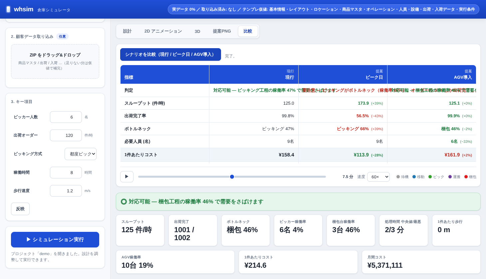
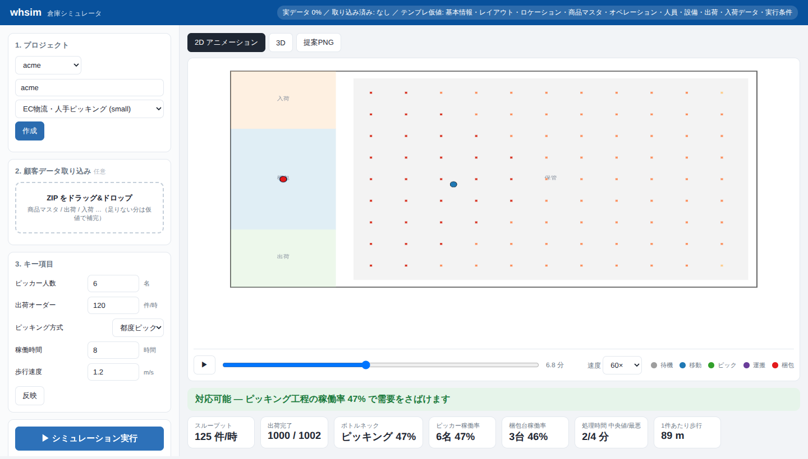
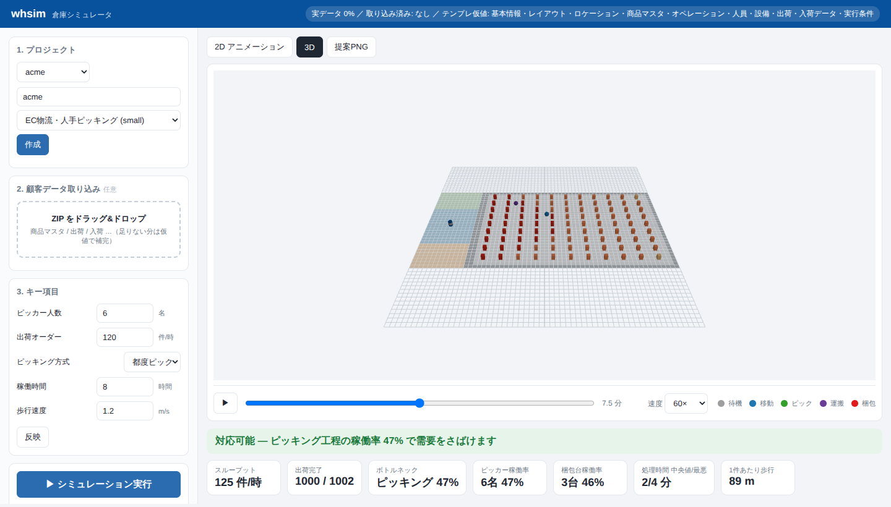

# whsim — 倉庫シミュレータ

**営業がゆるく組めて、裏で重厚なシミュレーションが走る**倉庫シミュレータ。

既存のシミュレータ（FlexSim / AnyLogic / Simio…）は、正確に動かすために全パラメータを最初に
埋めさせるため専門家しか使えません。whsim は **入力の難しさと計算の正確さを切り離す**ことで、
非エンジニア（営業）が顧客のゆるい要件をヒアリングしながらモデルを組み、裏で離散事象シミュレーション
（SimPy）を回して、**提案書にそのまま貼れる1枚の絵**を出すことを狙います。

## 設計の背骨：唯一の契約 = `model.json`

すべてのコンポーネントが、ひとつの正規スキーマ
（`whsim.schema.WarehouseModel`）を読み書きします。

```
  テンプレ ─────────┐
  ゆるい入力＋キー項目 ─┤
  分析ツールのZIP ────┼──▶  model.json  ──┬─▶ SimPyエンジン ─▶ KPI
  (将来) LLM対話 ────┘   (唯一の正)        ├─▶ 2D PNG（提案用）
                                          └─▶ (将来) 3Dレンダラ
```

- **テンプレート** = 全項目が仮値で埋まった `model.json`。だから取り込み前から必ず動く。
- **ZIP取り込み** = 分析ツールが出す複数JSON（`product_master` / `outbound` / `inbound` / `layout` …）を
  サブツリー単位で上書き。**壊れたファイルやJSON以外は優しくスキップ**し、バンドル全体は拒否しない。
  欠損は仮値のまま → **常に動く**。
- **プロベナンス**（出所＝`imported` / `interview` / `provisional`）を第一級機能として保持し、
  出力にも「N% your data」と明示。“簡単さ”と“信頼”を両立させ、将来のLLM質問リストにもなる。
- **プロジェクト（ワークスペース）** にすべてを永続化。分析ツールは供給元、whsim が正の保管庫。

## Web アプリ（営業が触る画面）

```bash
pip install -e ".[dev,web]"
whsim serve                               # http://127.0.0.1:8000
```

**設計（ハーネス）→ 検証**のループで使います。テンプレから始め、「設計」画面で
レイアウト・検証設備・作業フローをインタラクティブに編集 → （任意で）顧客ZIPを
ドラッグ&ドロップ → 「実行」で、**作業員が動く2Dアニメーション**と**three.jsの3Dビュー**、
KPI、提案PNGが出ます。専門用語は表に出しません。

### 設計モード（3PL エンジニアリングの治具）

「設計」タブに3つの道具。すべて唯一の契約 `model.json` を編集し、検証側が即反映します。

| 道具 | できること |
|---|---|
| **レイアウト** | ゾーンをドラッグで移動/リサイズ、種別変更、ラックは「通路×行間隔」のパラメトリック生成（営業でも壊れない構造的編集） |
| **設備** | AGV・コンベア・自動倉庫・梱包台を**クリックで自由配置** |
| **フロー** | 入荷→格納→ピッキング→梱包→出荷の**ワークフローが常に図で見え**、各工程の作業方式（人手/AGV/コンベア/自動倉庫）をインラインで変更 |

例：ピッキングを「人手→AGV」に変え、AGVを置いて実行すると、**人手の稼働率が下がり、
ボトルネックがピッキング→梱包へ移動**します（設備投資の効果が即座に検証できる）。

### AGV・コスト・シナリオ比較

- **AGV は個体エージェント**として実際に動き（タスクキュー方式で totes を搬送）、2D/3D で
  作業員とは別マーカーでアニメーション表示。AGV ⇄ ピッカーはパイプライン分離され、AGV化で
  少人数でもスループットを維持できる（＝省人化）ことを検証できる。
- **コスト KPI**：人件費（¥/人時）と設備の capex/opex から **1件あたりコスト・月間コスト・
  必要人員・投資回収（月数）** を算出。提案PNGには前提（人件費率・AGV投資額・償却）も明記。
- **ピーク日**：`peak_factor` でセール期の需要増を再現（平常 vs ピークで語れる）。
- **シナリオ比較（比較タブ）**：現行 / ピーク日 / AGV導入 を並べ、デルタ色分けの表＋提案PNGで
  「現行 vs 提案」を一枚に。役員が判を押す ¥/件・必要人員・投資回収まで。






| 画面 | 内容 |
|---|---|
| 2D アニメーション | レイアウト上を作業員が移動（色＝状態：待機/移動/ピック/運搬/梱包）。再生/一時停止/シーク/速度 |
| 3D | three.js で立体表示。同じ replay データを別レンダラで描画 |
| 提案PNG | 1枚で結論（対応可能/要注意＋ボトルネック＋人員＋混雑ヒートマップ） |

## CLI（バックエンド／自動化）

```bash
whsim templates                          # 利用可能なテンプレ一覧
whsim new acme --template ecommerce_small  # テンプレからプロジェクト作成（この時点で動く）
whsim estimate acme                      # 解析的な高速見積り（M/M/c、即答）
whsim run acme                           # 離散事象シミュレーション実行
whsim render acme                        # 提案用PNG（layout_heatmap.png）
whsim animate acme                       # 動く2DリプレイGIF（ブラウザ不要）
whsim simulate acme                      # run + render を一括

# 顧客データ（分析ツールが出したZIP）を取り込む：
python scripts/gen_sample_data.py        # examples/acme_upload.zip を生成
whsim new acme2 -t ecommerce_small
whsim import acme2 examples/acme_upload.zip
whsim simulate acme2
```

成果物は `projects/<name>/runs/run_XXXX/` に保存されます
（`kpis.json` / `heatmap.npy` / `replay.json` / `layout_heatmap.png` / `replay_2d.gif`）。

## アーキテクチャ

| モジュール | 役割 |
|---|---|
| `whsim/schema/model.py` | 正規スキーマ（pydantic）。全フィールドにデフォルト＝必ず妥当 |
| `whsim/templates.py` | テンプレ（仮値で満たした `model.json`）の読み込み |
| `whsim/importer.py` | ZIP→サブツリー判定→深いマージ→検証。寛容（壊れても止まらない） |
| `whsim/provenance.py` | 出所追跡（imported / interview / provisional）と信頼度 |
| `whsim/project.py` | ワークスペース永続化・実行管理 |
| `whsim/engine/` | SimPy 離散事象エンジン。作業員は**個体エージェント**で、軌跡（キーフレーム）を出力 |
| `whsim/analytic.py` | M/M/c による即時見積り。エンジンのサニティ・オラクルも兼ねる |
| `whsim/kpis.py` | イベントログ→KPI＋平易な判定文 |
| `whsim/render/replay.py` | リプレイ契約（2D/3D 両ビューが消費する軌跡データ） |
| `whsim/render/png2d.py` | 提案用2D PNG（レイアウト＋混雑ヒートマップ＋判定＋出所フッター） |
| `whsim/render/anim2d.py` | 動く2DリプレイGIF（サーバサイド、ブラウザ不要） |
| `whsim/web/` | FastAPI バックエンド＋SPA フロント（2Dキャンバス＋three.js 3D） |
| `whsim/cli.py` | `whsim` コマンド |

## 開発

```bash
pytest -q                                 # 全テスト
pytest tests/test_engine.py::test_kpis_are_sane   # 単一テスト
ruff check src                            # lint
python scripts/gen_template_ecommerce.py  # テンプレ再生成
```

## ロードマップ（議論中）

- LLM対話によるモデル生成・修正（プロベナンスの provisional 項目を質問リスト化）
- バッチ/ゾーン/ウェーブピッキングなど `pick_strategy` の実装拡充
- AGV/AMR・コンベア・AS/RS など搬送設備のモデル化
- 3Dレンダラ（同じ `model.json` ＋実行成果物を入力にする“もう一つのレンダラ”）
- シナリオ比較（today vs +Nピッカー）の並置出力
