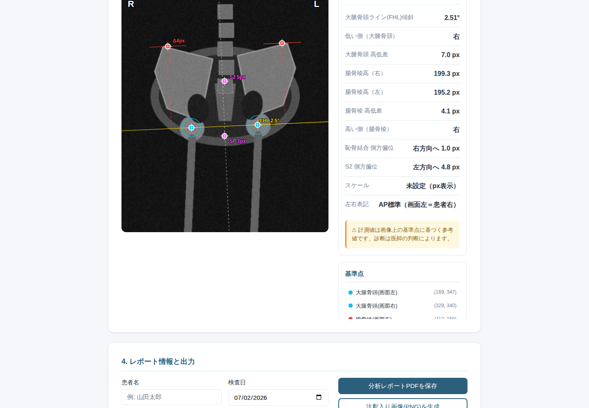

# カイロ骨盤分析アプリ (ChiroApp)

カイロプラクティック院向けの **レントゲン骨盤分析** + **整形外科への紹介状自動生成** デスクトップアプリ。

- 使う人向けの導入手順・操作ガイド → **[docs/INSTALL_ja.md](docs/INSTALL_ja.md)**
- 配布物: GitHub Actions が Windows / macOS(Intel) / macOS(Apple Silicon) の3種を自動ビルド



## 機能

### 1. レントゲン骨盤分析（ヒューマン・イン・ザ・ループ）
- **骨盤総合（Gonstead式・8基準点）**: 大腿骨頭線を真の水平基準に、大腿骨頭高低差（短下肢/MD）・
  腸骨稜高低差・**寛骨垂直長（腸骨稜→坐骨結節）でPI/AS寛骨の目安**・恥骨結合/S2の側方偏位（回旋）を計測。
  ほか骨盤傾斜・脚長差・脊椎アライメントの簡易モード
- **DICOM(.dcm)対応**: 圧縮転送構文(JPEG/JPEG2000/RLE)をデコード、Window/Level適用、
  **PixelSpacingから自動でmmスケール取得**（キャリブレーション不要）
- 自動検出（Hough円=大腿骨頭 / 上縁走査=腸骨稜）→ **施術者がドラッグ/矢印キーで補正** →
  計測値は即時再計算。Ctrl+Zで取り消し
- ズーム/パン、コントラスト・明るさ・ネガ反転（表示用フィルタ、出力にも同一適用）
- **臨床的な丸めと閾値**: 角度0.5°/長さ0.5mm、左右差≥5mmで有意判定。過剰精度を出さない
- **正直なスケール**: mm はフィルム面（拡大率未補正）と明示。未校正時は px のみ
- **体位回旋の警告**: 恥骨結合/S2の偏位が大きい時、高さ計測が回旋に歪められている可能性を明示
  （骨盤計測の体位敏感性 Weinert 2005 を踏まえる）
- **左右表記**: AP標準（画面左=患者右）。PA/反転画像用の切替あり、R/Lマーカー連動
- 出力: **分析レポートPDF**（患者名・所見サマリ・計測表・免責）/ 注釈入りPNG / 紹介状への添付 /
  **セッション保存(.json)** による作業の再開

### 2. 紹介状の自動生成
- 院内Webフォーム入力 → 紹介状PDFを即ダウンロード（X線注釈画像の添付可）
- Google Form連携用Webhook API (`/api/google-form-webhook`)
- 日本語の文字幅を考慮した折り返し・自動改ページ

## 配布用ビルド（Mac / Windows）

GitHub Actions の **Build desktop apps** ワークフローが push のたびに3種を自動ビルドします
（手動実行も可: Actions → Build desktop apps → Run workflow）。

| 成果物 | 対象 |
|---|---|
| `ChiroApp-Windows-x64.zip` | Windows 10/11（単一 `ChiroApp.exe`） |
| `ChiroApp-macOS-AppleSilicon.zip` | M1/M2/M3/M4 Mac（`ChiroApp.app`） |
| `ChiroApp-macOS-Intel.zip` | Intel Mac（`ChiroApp.app`） |

ローカルでビルドする場合（ビルドしたいOS上で）:
```bash
pip install -r requirements.txt pywebview pyinstaller
pyinstaller chiro_app.spec
# Windows: dist/ChiroApp.exe / macOS: dist/ChiroApp.app
```

## 開発

```bash
pip install -r requirements.txt
python app.py          # ブラウザで http://localhost:5000
python desktop.py      # ネイティブウィンドウ起動（pywebview、無ければブラウザに自動フォールバック）
python tests/test_basic.py   # テスト
```

`python app.py` で開いた場合は Chrome/Edge から PWA としてインストールも可能。

## 構成

```
desktop.py                  デスクトップ起動 (pywebview / ブラウザfallback / PyInstaller対応)
app.py                      Flask本体 (検出 / エクスポート / レポート / 紹介状 API)
modules/
  xray_analyzer.py          ランドマーク検出・計測・注釈描画 (幾何計算の正)
  dicom_loader.py           DICOM(.dcm)読込・Window/Level・PixelSpacing→mm
  xray_report.py            分析レポートPDF
  referral_letter.py        紹介状PDF (CJK折返し・改ページ・画像添付)
static/js/xray_editor.js    分析エディタ (SVG, ズーム/ドラッグ/undo, 計測ミラー実装)
templates/                  画面 (ホーム・紹介状・X線分析)
tests/test_basic.py         テスト
chiro_app.spec              PyInstaller設定 (Win=単一exe / mac=.app)
.github/workflows/build-desktop.yml   3プラットフォーム自動ビルド
docs/INSTALL_ja.md          利用者向けガイド
```

計測ロジックはサーバ(`xray_analyzer.py`)が正で、フロント(`xray_editor.js`)は
ライブ表示用に同一式をミラーしています。変更時は両方を更新してください。

## 注意

X線の計測値は画像上の基準点に基づく参考値です。診断は医師の判断によります。
本アプリは施術方針検討の補助ツールです。
