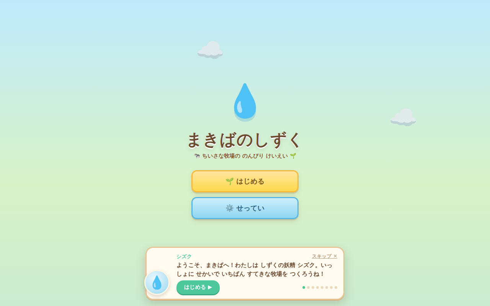
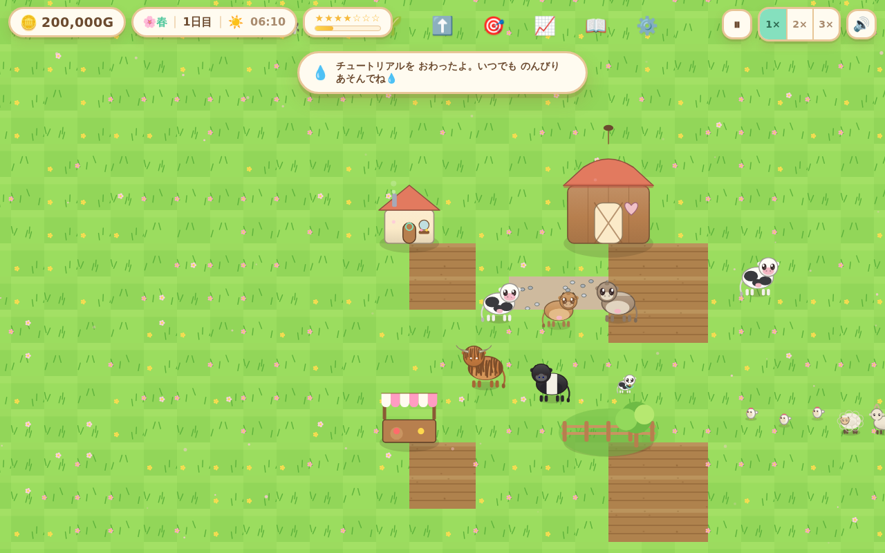
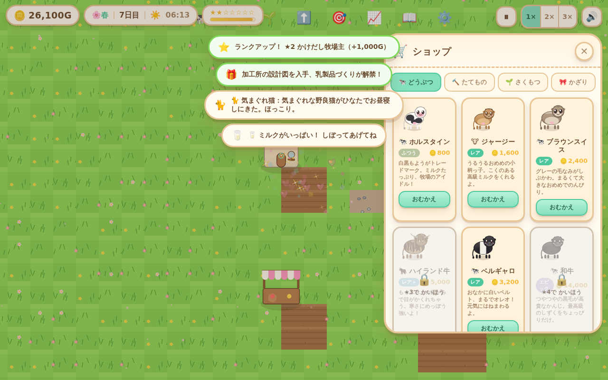
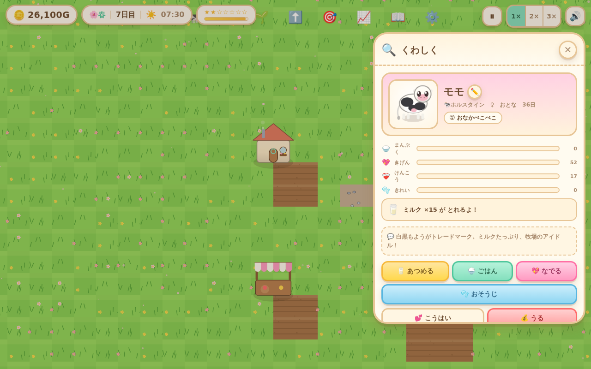
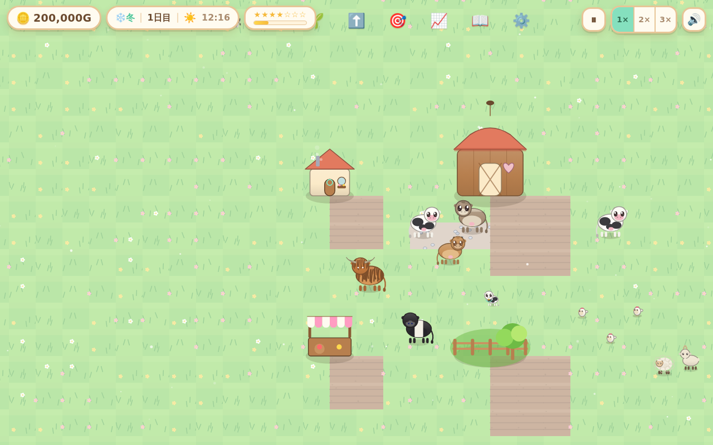

# 🐄 まきばのしずく (Makiba no Shizuku) — Ranch Droplet

> ぼろぼろの小さな牧場を、世界いちかわいい大牧場に育てよう。🌱💧
> *Grow one rundown little farm into the cutest, most sprawling ranch in the world — one dewdrop at a time.*

A cute, cozy, **super‑vast ranch‑management simulator** that runs entirely in the browser as a single self‑contained HTML file. Raise adorable cows (and chickens, sheep, alpacas, and more), run a dairy business, farm feed crops, breed wobbly babies, ride the seasons and the market, and climb from ★1 to ★7 — with a dewdrop fairy named **シズク** cheering you on. No dead‑ends, no game‑over: only a beautiful ranch to keep tending.

<p align="center">
  
  
</p>
<p align="center">
  
  
  
</p>

Built with **vanilla JavaScript + Canvas2D** — no engine, no frameworks, no external assets. Every sprite is drawn procedurally; every sound is synthesized with the Web Audio API; art fits in one `index.html`.

---

## ▶️ あそぶ / Play

- **Play now:** open the published artifact (link shared in the chat), or
- **Local:** run the build and open `index.html` in any modern browser:
  ```bash
  npm install        # (only needed for the headless test harness)
  npm run build      # assembles src/ -> index.html (+ build/makiba-no-shizuku.html)
  # then open index.html
  ```

The game autosaves to `localStorage`; close and come back anytime.

### そうさ / Controls
- **ドラッグ** でスクロール、**ホイール／ピンチ** でズーム (drag to pan, wheel/pinch to zoom)
- どうぶつを **タップ** でなでなで💗、長押し／情報で「くわしく」 (tap an animal to pet it; open its inspector for details)
- 下または上のボタンから ショップ・マーケット・アップグレード・もくひょう などを開く
- キーボード: `WASD`/矢印=移動, `+`/`-`=ズーム, `Space`=一時停止, `1`/`2`/`3`=速度, `Esc`=キャンセル

---

## ✨ とくちょう / Features

- **8 cow breeds** — ホルスタイン, ジャージー, ブラウンスイス, もふもふハイランド, オレオ柄ベルギャロ, 高級和牛, ちびミニ牛, デクスター — each with its own look, personality, and milk profile.
- **10 more animals** — ニワトリ・アヒル・ヒツジ・ヤギ・ブタ(トリュフ！)・アルパカ・ウサギ・イヌ・ネコ・ウマ, with pets that boost happiness and "看板犬/猫" that nudge market prices.
- **Animal care** — four gentle needs (まんぷく／きげん／けんこう／きれい). Neglect only softens output; full care always restores. Nothing ever dies.
- **Production chains** — milk → cheese / butter / yogurt at the 加工所, plus eggs, wool, fine wool, truffles, goat milk, and manure.
- **Crop & feed farming** — 10 crops with growth stages, watering, seasons, withering, and regrowth; grow your own feed to close the loop.
- **Breeding** — pair two happy adults for a wobbly baby that grows up, with gentle genetics and rare cosmetic traits (sparkle coat, heterochromia, golden ✨).
- **Building & automation** — barns, coops, silos, dairy, well, windmill, market stall, plus 25 upgrades (auto‑milker, sprinklers, cozy bedding, heaters…).
- **Living market** — clamped mean‑reverting prices with 7‑day sparklines, seasonal demand, supply gluts, and a market‑stall bonus. Sell high, hold low.
- **Seasons & weather** — a 12‑day season / 48‑day year with a day‑night cycle, warm window glow at night, and rain/snow/cloud atmosphere that recolors the whole ranch.
- **Events & almanac** — charming positive events (stray kittens, rainbows, traveling merchants, festivals), 22 achievements, and an encyclopedia of everything you've discovered.
- **7 ranch ranks** — from かけだし牧場主 to しずくの守り人, gated by net worth and goals.

---

## 🧱 Architecture

The game is authored as small modules in `src/js/` that each attach to a global `Game` namespace, then **concatenated into one `index.html`** by `tools/build.js` (each module wrapped in its own IIFE; content/balance JSON embedded as `Game.DATA`).

```
src/js/
  00-data.js  normalizes content+balance JSON into the frozen Game.DATA API
  util.js     seeded RNG (mulberry32), math/easing, formatting, EventBus (Game.bus)
  state.js    newGame() builds the full initial world as data
  save.js     localStorage persistence + migration + autosave
  time.js     day/season/weather clock
  economy.js  money, market, inventory, upgrades, rank, goals, achievements, events, dairy
  world.js    tile grid, building placement/upgrade, capacity
  crops.js    plant / grow / water / harvest / wither
  animals.js  needs, production, breeding, aging, wander AI
  sprites.js  procedural cute art for every breed/animal/building/crop
  render.js   camera, y-sorted layers, day-night light, particles, juice
  audio.js    synthesized SFX + pastoral music (Web Audio)
  input.js    pan/zoom, placement tools, picking, keyboard
  ui.js       HUD, dock, panels, notifications, modals, title screen (+ src/css/styles.css)
  tutorial.js gentle skippable onboarding
  game.js     boot + crash-isolated fixed-timestep loop + Game.test.* hooks
```

**Core model:** all heavy simulation runs once per in‑game day in `day:advance` handlers (the "overnight" model), so fast‑forward is exact and deterministic and the per‑frame `update()` only does smooth movement and animation.

Design docs live in [`docs/design/`](docs/design/): the game design doc, art bible, technical architecture, and the implementer brief. Tunable content and balance live in [`data/content.json`](data/content.json) and [`data/balance.json`](data/balance.json).

### コマンド / Commands
```bash
npm run build    # assemble the single-file game -> index.html
npm test         # headless Chromium QA: boots the game, drives a scenario,
                 # captures console errors + screenshots (build/shots/)
npm run smoke    # quick boot-only smoke test
```

---

## 🎨 Credits

Design, art direction, balance, and code generated with a multi‑agent workflow. Everything is procedural and self‑contained — open `index.html` and it just runs. のんびり あそんでね 💧🐄
