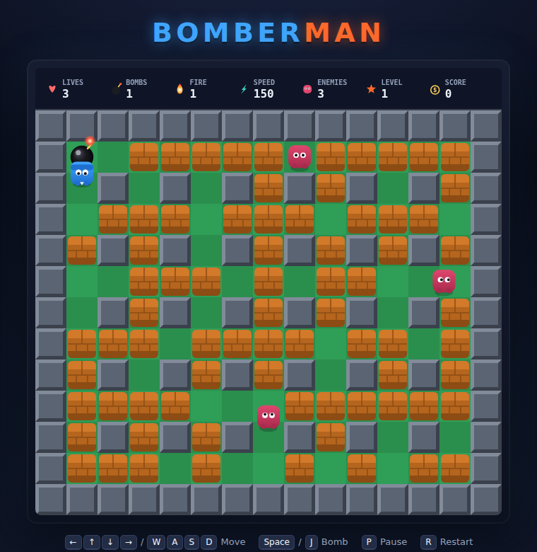

# 💣 Bomberman

A complete, self-contained Bomberman clone that runs in the browser — no build step, no
dependencies, no assets. All graphics are drawn procedurally on a `<canvas>` and all sound is
synthesized with the Web Audio API.



## Play

The game uses plain classic `<script>` files, so you can just open it:

```bash
# Option A — double-click / open the file directly
open index.html        # macOS   (xdg-open on Linux, start on Windows)
```

Or serve it (any static server works):

```bash
# Option B — local web server
python3 -m http.server 8000
# then visit http://localhost:8000
```

## Controls

| Action | Keys |
| --- | --- |
| Move | Arrow keys or **W A S D** |
| Drop bomb | **Space** / **J** |
| Pause | **P** |
| Restart | **R** |

## How to play

- Blow up the **bricks** to carve paths and uncover **power-ups**.
- Destroy **every enemy** on a stage to clear it and advance to the next (enemies get faster and
  smarter as you go).
- Bombs explode in a **+** shape; the blast is stopped by hard walls and destroys the first brick
  it hits. Don't get caught in your own flames — and chain bombs together for combos.
- You have a limited number of **lives**; touching an enemy or standing in a blast costs one.

### Power-ups

| Icon | Name | Effect |
| --- | --- | --- |
| **B** | Bomb Up | Carry one more bomb at a time |
| **F** | Fire Up | Bigger blast radius |
| **S** | Speed Up | Move faster |

## Architecture

Everything is vanilla JavaScript split into small classic scripts under `js/` (they share one
global scope and are loaded in dependency order by `index.html`):

| File | Responsibility |
| --- | --- |
| `config.js` | All tunable constants, the color palette, tile/direction/power-up enums |
| `sound.js` | `Sound` — synthesized Web Audio SFX (never throws) |
| `map.js` | `GameMap` — grid generation and tile queries |
| `physics.js` | `Physics` — axis-separated AABB collision resolution |
| `input.js` | `Input` — keyboard state with edge-triggered actions |
| `powerup.js` | `Powerup` — power-up entities |
| `bomb.js` | `Bomb`, `Explosion`, `computeExplosion()` — fuses, blast shapes |
| `enemy.js` | `Enemy` — grid-aligned wandering / chasing AI |
| `player.js` | `Player` — movement, bomb placement, stats |
| `render.js` | `Renderer` — all procedural canvas drawing + HUD |
| `game.js` | `Game` — the state machine that ties it together |
| `main.js` | Bootstraps the canvas and runs the `requestAnimationFrame` loop |

The game logic is frame-rate independent: the loop passes a clamped delta-time (seconds) into every
`update(dt, game)`.

## License

MIT — do what you like.
