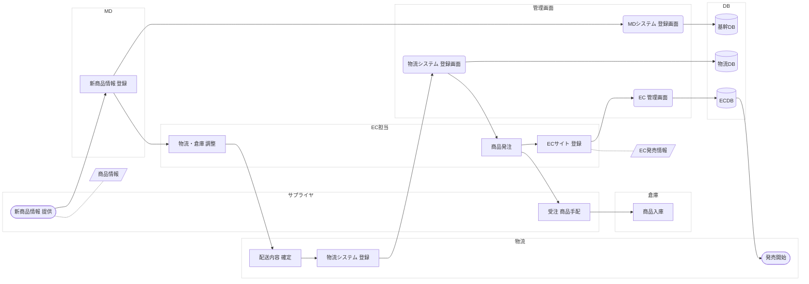

# flow.yaml の実例と、確認用 Mermaid の書き方

書き方に迷ったら、この実例をコピーして書き換えるのが早いです。あわせて、会話の中で流れを確認するための Mermaid 下書きの作り方を示します。

## 実例：EC商品登録の流れ（7レーン7工程）

```yaml
meta:
  title: サンプルフロー図 ※簡易版としてのEC商品登録までの流れ
  version: "1.0"
  grid:
    lane_h: 88
    col_w: 150
    show_columns: false

# Y軸: 上から順に描かれる。人のレーンを上、システム系(kind: system)を下に置く。
lanes:
  - {id: ec,       label: EC担当}
  - {id: md,       label: MD}
  - {id: supplier, label: サプライヤ}
  - {id: logi,     label: 物流}
  - {id: wh,       label: 倉庫}
  - {id: screen,   label: 管理画面, kind: system}
  - {id: db,       label: DB,       kind: system}

# X軸: 工程ステップ。左から右に時間が流れる。
columns:
  - {id: c1, label: 商品情報提供}
  - {id: c2, label: MD登録}
  - {id: c3, label: 物流調整}
  - {id: c4, label: 配送確定}
  - {id: c5, label: 物流システム登録}
  - {id: c6, label: 発注・入庫}
  - {id: c7, label: EC公開}

nodes:
  - {id: n010, lane: supplier, col: c1, type: external, label: 新商品情報\n提供}
  - {id: a010, type: data, label: 商品情報, attach: {to: n010, at: br}}

  - {id: n020, lane: md,     col: c2, type: process, label: 新商品情報\n登録}
  - {id: n021, lane: screen, col: c2, type: screen,  label: MDシステム\n登録画面, system: MDシステム}
  - {id: n022, lane: db,     col: c2, type: db,      label: 基幹DB}

  - {id: n030, lane: ec,     col: c3, type: process, label: 物流・倉庫\n調整}
  - {id: n040, lane: logi,   col: c4, type: process, label: 配送内容\n確定}

  - {id: n050, lane: logi,   col: c5, type: process, label: 物流システム\n登録}
  - {id: n051, lane: screen, col: c5, type: screen,  label: 物流システム\n登録画面, system: 物流システム}
  - {id: n052, lane: db,     col: c5, type: db,      label: 物流DB}

  - {id: n060, lane: ec,       col: c6, type: process, label: 商品発注}
  - {id: n061, lane: supplier, col: c6, type: process, label: 受注\n商品手配}
  - {id: n062, lane: wh,       col: c6, type: process, label: 商品入庫}

  - {id: n070, lane: ec,     col: c7, type: process,  label: ECサイト\n登録}
  - {id: a070, type: data, label: EC発売情報, attach: {to: n070, at: bl}}
  - {id: n071, lane: screen, col: c7, type: screen,   label: EC\n管理画面, system: ECサイト}
  - {id: n072, lane: db,     col: c7, type: db,       label: ECDB}
  - {id: n073, lane: logi,   col: c7, type: external, label: 発売開始}

edges:
  - {from: n010, to: n020}
  - {from: n020, to: n030}
  - {from: n020, to: n021}
  - {from: n021, to: n022}
  - {from: n030, to: n040}
  - {from: n040, to: n050}
  - {from: n050, to: n051}
  - {from: n051, to: n052}
  - {from: n051, to: n060}
  - {from: n060, to: n061}
  - {from: n061, to: n062}
  - {from: n060, to: n070}
  - {from: n070, to: n071}
  - {from: n071, to: n072}
  - {from: n072, to: n073}
```

読み方のポイントです。

- 人のレーン（EC担当・MD・サプライヤ・物流・倉庫）が上、システム系のレーン（管理画面・DB）が下に並んでいます。
- c6「発注・入庫」には商品発注・受注商品手配・商品入庫の3つが並びます。担当が違うだけで一連の流れなので、同じ列に置きます。
- 画面のノードには `system:` が付いていて、これは図には出ず処理一覧に出ます。
- 帳票（商品情報・EC発売情報）は `type: data` の添付ノートで、lane と col を書いていません。

## 確認用 Mermaid の作り方

Mermaid は**下書き・チャット内での確認専用**です。清書には使いません。Mermaid には真のスイムレーンがなく、位置を制御できないため、subgraph による近似にとどまります。時間軸のグリッド（列）は再現できません。この点は図を出すたびに必ず一言添えてください。

### 変換ルール

1. 1行目は `flowchart LR`（横に流す場合。縦にしたいときは `TD`）。
2. レーンごとに `subgraph LANE_<レーンID>["<レーン名>"]` を作り、そのレーンに属するノードを flow.yaml の登場順に並べ、`end` で閉じます。ノードが1つもないレーンは書きません。
3. subgraph の中に `direction LR` を書きます。
4. `attach` を持つノート（lane を持たないノード）はレーン外に置き、貼り付け先と `-.-` で結びます。
5. edges を変換します。`kind: flow` は `-->`、`kind: data` と `kind: trigger` は `-.->` です。label があるときは `A -->|ラベル| B` の形にします。
6. ラベル中の改行は半角スペースに、ダブルクォートはシングルクォートに置き換えます。
7. 最後にレーン枠を薄くする classDef を付けます。

### ノード種別ごとの Mermaid 記法

| flow.yaml の type | Mermaid の記法 |
|---|---|
| `process` | `n010["ラベル"]` |
| `screen` | `n010("ラベル")` |
| `db` | `n010[("ラベル")]` |
| `external` | `n010(["ラベル"])` |
| `terminal` | `n010(["ラベル"])` |
| `decision` | `n010{"ラベル"}` |
| `data` | `n010[/"ラベル"/]` |
| `manual` | `n010[/"ラベル"/]` |
| `batch` | `n010[["ラベル"]]` |

### 上の実例を変換した結果



## 出力の使い分け

| 出力 | 位置づけ | 注意 |
|---|---|---|
| flow.yaml | 正。すべての出発点 | このエージェントの成果物はこれ |
| Mermaid | 下書き・チャット内確認 | スイムレーンがなく位置制御できない。清書には使わない |
| .drawio | 納品物 | Claude Code 側で生成。他部署が編集でき、差分も取れる |
| プレビューSVG | 自己検証用 | Claude Code 側で生成。線の経路は近似 |
| 処理一覧.xlsx | 設計書の付録 | Claude Code 側で生成。処理一覧・接続一覧・データ一覧・定義シート |

図が綺麗に出ることは目的ではありません。**図が他の成果物と整合していることを保証できる**のが目的です。
