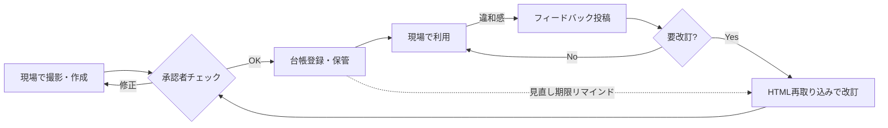

# 現場マニュアル 運用設計書（トータルデザイン）

作成ツール（`index.html`）で作ったマニュアルを、**現場が自走して作り続け・使い続け・直し続ける**ための運用設計。ツールの機能と運用ルールをワンセットで設計している。

---

## 1. なぜ手順書は形骸化するのか → 打ち手の対応表

| 形骸化の原因 | 打ち手 | 担うもの |
|---|---|---|
| 作るのが大変（Word清書・写真貼付が苦行） | 撮る→書くだけ、1本5〜15分で完成 | ツール（作成画面） |
| 更新が億劫で現実とズレていく | 書き出したHTMLを再取り込み→修正→版数上げで改訂5分 | ツール（取り込み機能） |
| どこにあるか分からない | 保管場所を1つに決める＋設備にQR掲示 | 運用ルール §5 |
| 見直す機会がない | 次回見直し日を設定→**期限切れをマニュアル自身が警告**＋台帳リマインド | ツール＋Teams/Kintone |
| 使う場面がない | 点検チェックリスト・新人教育・引き継ぎに組み込む | 運用ルール §7 |
| 指摘しても直らないので誰も言わなくなる | フィードバックボタン→コピー→チャネル投稿、**48時間以内一次返信**ルール | ツール＋運用ルール §6 |

**設計思想：** ルールで縛るのではなく、「作る・直すコストを限界まで下げる」「使う場面をカレンダーに埋め込む」「劣化をツールが自己申告する」の3点で自走させる。

## 2. 全体フロー



## 3. 役割分担（最小3役・兼任可）

| 役割 | 誰が | やること | 目安工数 |
|---|---|---|---|
| 作成者 | 現場全員 | 作業を撮って作る、フィードバックに気付いたら直す | 1本15分 |
| 承認者 | 職長・班長 | 内容確認、承認欄に名前、状態を「運用中」へ | 1本5分 |
| 管理者 | 1名（固定） | 台帳管理、リマインド対応、フィードバックの一次返信 | 週30分 |

## 4. ルール3点セット

### 4.1 命名・管理番号
```
[管理番号]_[設備]_[作業]_v[版数].html
例: M-012_プレス2号機_始業点検_v1.2.html
```
管理番号は台帳（Kintoneレコード番号 or Teams Lists のID）と一致させる。

### 4.2 版管理
- 誤字・写真差し替えなど軽微 → **0.1** 上げ（1.0→1.1）
- 手順の追加・削除・順序変更 → **1.0** 上げ（1.2→2.0）＋再承認
- 旧版は削除せず `90_旧版` フォルダへ移動（監査・事故調査で必要になる）
- ツールの「改訂メモ」に今回の変更点を1行書く（書き出しHTMLの冒頭に表示される）

### 4.3 2ファイル運用（重要）
**SharePoint・Kintoneとも、HTMLファイルはブラウザ内で表示されずダウンロード扱いになる。** そのため：

- **閲覧用：PDF**（ツールの「印刷/PDF」でスマホからも保存可）→ Teams/Kintone上でそのままプレビューできる
- **マスター：HTML**（再取り込みして改訂するための原本。チェックリスト・現場モードなど対話機能もこちら）

日常閲覧はPDF、点検チェックや改訂はHTMLをダウンロードして開く、と使い分ける。

## 5. 保管場所の選択（Teams / Kintone / どちらでもない場合）

| 観点 | Teams (SharePoint) | Kintone | 共有ファイルサーバ |
|---|---|---|---|
| 台帳・ステータス管理 | Lists で可 | ◎ 得意分野 | ✕ 手作業 |
| 見直しリマインド | Power Automate で可 | ◎ 標準の通知機能 | ✕ |
| 承認フロー | Approvals で可 | ◎ プロセス管理 | ✕ |
| フィードバック受け口 | ◎ チャネル投稿 | ○ レコードコメント | ✕ |
| 現場スマホからの閲覧 | ○ Teamsアプリ | ○ Kintoneアプリ | △ |
| 追加費用 | M365内 | Kintone内 | なし |

**選定基準：迷ったら「リマインド通知が確実に人へ届く方」を選ぶ。** 形骸化防止の生命線は見直し通知なので、既にKintoneが日常業務に入っているならKintone、Teamsが日常ならTeams。両方あるなら台帳=Kintone・議論=Teamsの併用も可。

### 5.1 Teams構成案
- チーム「現場マニュアル」／チャネル＝部署 or ライン単位
- ファイルタブ: `01_運用中／02_下書き・承認待ち／90_旧版／99_ツール（index.html本体）`
- **Lists「手順書台帳」**: 管理番号／タイトル／設備／版数／状態／次回見直し日／承認者／ファイルリンク
- **Power Automate**: 「次回見直し日が30日以内」→管理者と作成者にメンション通知（週1バッチで十分）
- フィードバック: マニュアルの📢ボタンでコピー→該当チャネルに貼るだけ。スレッドで対応を追う

### 5.2 Kintone構成案（アプリ「手順書台帳」）

| フィールド | 型 |
|---|---|
| 管理番号 | レコード番号 |
| タイトル／設備・現場 | 文字列 |
| 版数 | 文字列 |
| 状態 | ドロップダウン（下書き／承認待ち／運用中／要見直し／廃止） |
| 次回見直し日 | 日付 |
| 作成者／承認者 | ユーザー選択 |
| マニュアル（HTML＋PDF） | 添付ファイル |
| 改訂履歴 | テーブル（日付・版数・変更内容） |

- **プロセス管理**: 作成中 →（申請）→ 承認待ち →（承認）→ 運用中 →（期限）→ 要見直し →（改訂 or 廃止）
- **通知（リマインダー）**: 次回見直し日の30日前・当日に作成者＋管理者へ
- **一覧「⚠要見直し」**: 状態=要見直し or 見直し日超過で絞り込み。朝礼で件数だけ共有
- フィードバック: 該当レコードのコメント欄に貼る→改訂時にテーブルへ転記

### 5.3 現場が「探さない」仕掛け
設備・作業場所に **QRコード（該当マニュアルのTeams/KintoneのURL）をラミネートして掲示**。スマホで読む→開く→現場モード、まで10秒。QRは無料の生成サービスでも、Power Automate/kViewerでも作れる。

## 6. フィードバック運用（形骸化防止の生命線）

1. 現場：マニュアルの「📢フィードバック」→内容を書いて「まとめてコピー」→チャネル/レコードコメントに貼る（30秒）
2. 管理者：**48時間以内に一次返信**（「直します」「保留、理由は〜」だけでよい）
3. 要改訂なら作成者がHTMLを再取り込み→修正→版数上げ→再承認
4. 月次で「フィードバック件数／対応済み率」を集計

**48時間ルールが守れなくなったら形骸化の初期症状**と判断し、管理者の負荷を見直す。

## 7. 使う場面をカレンダーに埋め込む

- **毎日**: 点検系マニュアルはチェックリストとして使用（使うこと自体が鮮度チェックになる）
- **新人・応援受け入れ時**: 必ずマニュアルベースで教える（教える側が古さに気付く最強の検知器）
- **月次5分**: 朝礼で「要見直し件数」「今月のフィードバック」を共有
- **四半期**: KPIレビュー（§8）

## 8. KPI（測るのは4つだけ）

| KPI | 計算 | 健全ライン |
|---|---|---|
| 登録数 | 台帳の運用中件数 | 増え続けている |
| 期限内率 | 見直し期限内の割合 | 90%以上 |
| フィードバック件数 | 月あたり | **0件が続く方が危険**（使われていない兆候） |
| 対応率 | 一次返信48h以内の割合 | 90%以上 |

## 9. 立ち上げ90日ロードマップ

| 期間 | やること | ゴール |
|---|---|---|
| Week 1–2 | パイロット：1ライン・作成5本。ツール配布（index.htmlを共有場所に置く） | 「15分で作れる」体感を作る |
| Week 3–4 | 台帳アプリ/Lists作成、承認フロー・命名規則を確定、QR掲示 | 5本が「運用中」になる |
| Month 2 | 横展開：各職場で月2本ノルマではなく「新人が困った作業から」作る | 20〜30本 |
| Month 3 | KPI初回レビュー、リマインド初回発火の確認、ルール微調整 | 自走判定 |

## 10. セキュリティ・注意事項

- 写真に**顔・個人名・顧客名・秘匿情報**を写り込ませない（撮影前に一声）
- 作成データは**端末ローカル保存**（IndexedDB）。端末変更・紛失に備え、ツールの「全データをバックアップ」を**週1でTeams/Kintoneに保存**する
- 端末の共有利用時は、他人のマニュアルを消さないよう削除操作に注意（削除確認あり）

## 11. FAQ

- **Q. スマホの容量は大丈夫？** 写真は自動で横1280pxに縮小。1本(写真10枚)で2〜3MB程度。
- **Q. PCでも作れる？** 可。写真はファイル選択になる。現場で撮ってPCで清書する場合はバックアップ(.json)かHTML書き出しで受け渡す。
- **Q. 誰かが書き出したHTMLを自分の端末で直せる？** 可。「取り込み」でHTMLを読み込めば編集状態に戻る。
- **Q. Excel台帳ではだめ？** 通知が飛ばない台帳は必ず腐る。最低限リマインドだけは自動化する。
