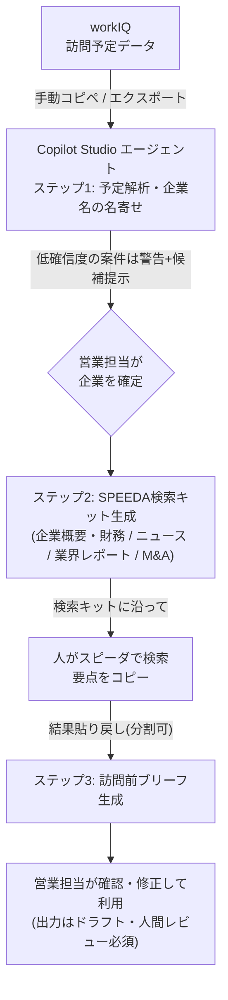

# 営業訪問準備エージェント PoC（workIQ × SPEEDA × Copilot Studio）

## 1. これは何か

直近の訪問予定（workIQ）から訪問先企業を特定し、スピーダ（旧SPEEDA）での情報収集を経て、
**訪問前ブリーフ（A4 1ページ以内・訪問前5分で読める分量）** を半自動生成するPoC。
Microsoft Copilot Studio 上の単一エージェントが「①予定解析・名寄せ → ②SPEEDA検索キット生成 → ③ブリーフ整形」の
3ステップ会話で営業担当を支援する。API連携は行わず、human-in-the-loop（コピペ運用）で成立させる。

## 2. 全体フロー



## 3. 設計判断

### なぜ human-in-the-loop（コピペ運用）か

- **API連携不可の制約**: workIQ・SPEEDAとも外部API連携は不可と確定している（「外部もAPIは厳しい」）。
- **SPEEDAの規約面**: 姉妹サービス「スピーダ イノベーション情報リサーチ」利用規約 第5条第5項は、
  クローラー・ボット・スクレイピング等のプログラムによるコンテンツ取得と、社内外DBへの蓄積を明文で禁止し、
  コンテンツ利用を内部利用目的に限定している（原文PDFで確認済み。本体「経済情報リサーチ」の規約全文は未確認のため、
  導入前に契約書面での確認が必要）。したがってRPA等での自動取得は行わず、**人がUIで検索して転記する**運用が安全。
  ブリーフへの転載は社内利用・要点引用にとどめ、出典（スピーダ）を明記する。
- **技術面でも妥当**: Copilot Studioの会話中ファイル添付はチャネル依存が大きく確実に動く保証が取れないため、
  テキスト貼り付けが最も堅牢。Microsoft公式のExecutive Briefingテンプレートも
  「出力はドラフトであり人間のレビューが必須」と明記しており、HITL設計の公式な先例がある。

### なぜ単一エージェント・3ステップ会話か

- Copilot Studioの生成オーケストレーションは**非決定的**で、instructionsだけではステップ順序を保証できない。
  本PoCは「貼られた入力の内容からフェーズを判定する」設計（訪問予定らしきテキスト→ステップ1、
  SPEEDA結果らしきテキスト→ステップ3）を採用し、ユーザーが順不同で貼っても動くようにする。
  厳密な順序保証が必要になったらトピック（決定的レイヤー）での実装に切り替える。
- instructionsの上限は8,000文字だが、長い指示はレイテンシ・無視の原因になるため本PoCの指示は約2,800字に抑えている。
  今後指示が上限に近づいた場合は、詳細な整形ルールや出力例をナレッジ（アップロードファイル）側に逃がす（本PoCでは未使用）。
- ワークフローを3ステップに分割し、貼られた入力の内容からステップを自動判定する
  （営業担当にモード切替コマンドを覚えさせない設計とし、学習コストを下げる）。
  PoC規模ではマルチエージェント分割は過剰と判断した。

### 名寄せの3段構え

①正規化して確定できるものは自動確定 → ②曖昧なものは複数候補+確信度+根拠を1つの確認表にまとめて提示し、営業担当が一括回答 →
③特定不可は正直に「特定不可」と出す。確認は曖昧なときだけ提示し、承認疲れを避ける。
正式商号の確定キーとして法人番号（国税庁 法人番号公表サイト）の人手確認を推奨する。

## 4. リポジトリ構成

```
poc/
├── README.md                # 本ファイル（全体像・設計判断・成功基準）
├── copilot-studio/
│   ├── instructions.md      # Copilot Studio に貼るエージェント指示本文（日本語・唯一の原本）
│   └── setup-guide.md       # セットアップ手順書（エージェント作成〜Teams/M365 Copilot公開・テスト手順）
└── sample-data/
    └── test-data.md         # テストデータ一式（workIQ風訪問予定CSV・SPEEDA貼り付け例〔一括/分割の2種〕・
                             #   期待ブリーフ出力例・評価チェックリストを1ファイルに収録）
```

## 5. PoC成功基準（測定可能な形で）

| # | 基準 | 測定方法 |
|---|---|---|
| 1 | 名寄せ精度 | ダミーCSVの表記ゆれ（前株/後株・カナ/英字等）を全件処理し、自動確定の誤りゼロ。低確信度の案件には警告と候補提示が出る |
| 2 | 件数突合 | 貼り付けた予定の行数と解析結果の件数が一致することをエージェントが自ら確認表示する |
| 3 | 所要時間 | ブリーフ1件の作成時間が手作業比で半減（現状相場30〜60分 → 検索キット利用で15〜30分以内）。3件以上で計測 |
| 4 | ブリーフ品質 | 営業担当2名以上が実案件相当のダミーで「訪問前に読みたい」と評価（5段階で4以上） |
| 5 | 分量・体裁 | ブリーフはA4 1ページ以内・5分で読める分量。スピーダ由来の記述に出典明記率100% |
| 6 | 分割貼り付け | 長文のSPEEDA結果を分割して貼っても、終了合図まで待って1つのブリーフに統合できる |

## 6. 既知の限界

- **コピペ運用の手間**: 訪問1件あたり最低2回の貼り付け往復（予定→検索キット、SPEEDA結果→ブリーフ）が発生する。
- **SPEEDA検索の質が人に依存**: 検索キットで手順を平準化するが、担当者の検索スキル・取捨選択で結果の質が変わる。
- **長文貼り付けの分割**: ユーザーメッセージは約8,000文字が上限との情報（二次情報・要実測）があり、
  SPEEDA結果は容易に超えるため「連番+終了合図」の分割貼り付けプロトコルを前提とする。
- **形式ゆれ**: Excel/画面からのコピペはタブ区切り・セル内改行による行割れが起きうる。
  見出し付き貼り付けテンプレートの利用と、エージェント側の件数突合で緩和する。
- **workIQの正体が未確定**: 「workIQ」という営業支援製品は調査で特定できず、文脈上は
  Microsoft Work IQ（訪問予定の実体=Outlook予定表）の可能性が高い。**発注者への確認が必要**
  （社内ツールか、Microsoft Work IQか。訪問予定はOutlook予定表に入っているか）。
- **規約面の残課題**: スピーダ本体の利用規約全文、および検索結果を社内AIエージェントへ貼り付ける行為の
  契約上の扱いは未確認。導入前にユーザベース社との契約条件を確認すること。

## 7. 次フェーズのロードマップ

調査で実現可能性を確認できた範囲での拡張パス。いずれもライセンス・管理者承認・契約の確認が前提。

### Phase 2: 訪問予定取得の半自動化（コピペの削減）

- workIQがMicrosoft Work IQ（=Outlook予定表）であれば、**Office 365 Outlook標準コネクタ**（全プランに含まれる）
  +エージェントフローで予定を直接取得できる。予定がSharePointリストに同期できる場合も標準コネクタで代替可。
- **Work IQ Calendar MCP（プレビュー）** でOutlook予定を直接取得する経路もある。
  ただしプレビュー機能・テナント管理者による有効化・Copilotクレジット従量課金が障壁のため、GA後に再評価する。

### Phase 3: SPEEDA側の自動化（貼り戻しの削減）

- **Speeda MCP連携**（2026年7月トライアル開始、**2026年9月1日正式提供予定**）により、
  MCP対応のCopilot等からスピーダの企業・業界・財務データを直接呼び出せる公式経路が予定されている。
  Copilot StudioはMCP接続に対応しており、契約次第で「人手貼り付け」を段階的に置き換えられる。
  料金・利用条件は順次発表のため、正式提供後に契約と接続可否を確認して判断する。
- 自動化はスクレイピングではなく、この**公式に許可された経路**でのみ行う（規約整合の原則を維持）。

---
※ 本READMEの外部仕様（文字数上限・提供時期等）は2026年8月時点の調査に基づく。
Copilot Studioの仕様は変更が頻繁なため、実装時にMicrosoft Learnの該当ページと実機での再確認を推奨する。
