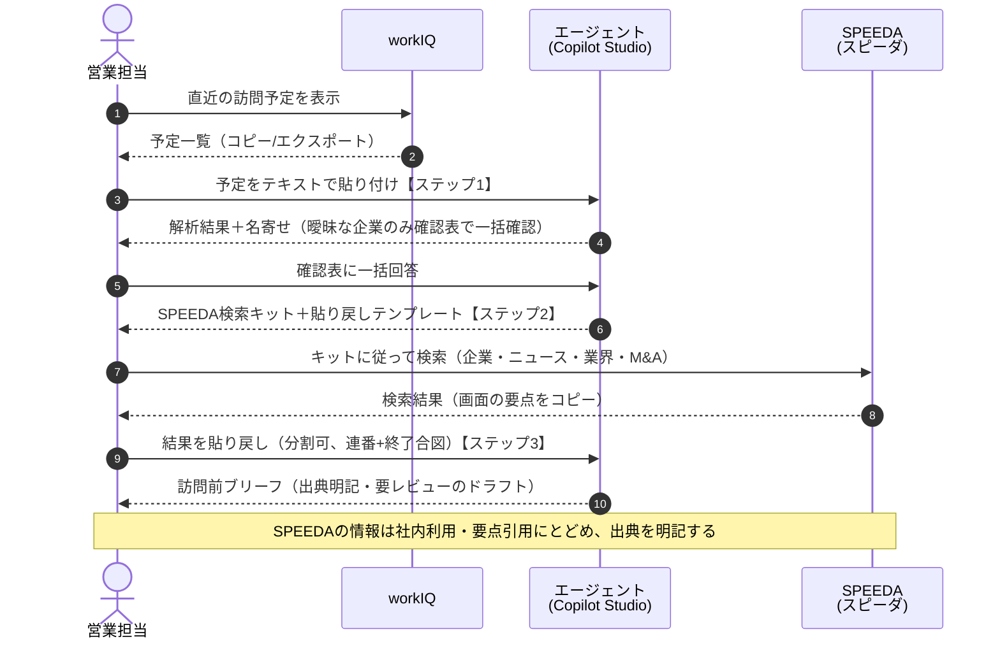

# セットアップ手順書 — 訪問準備エージェント（Copilot Studio PoC）

本書は、workIQ の訪問予定と SPEEDA（スピーダ）の企業情報をもとに訪問前ブリーフを生成する
Copilot Studio エージェントを、ゼロから作成して動作確認するまでの手順をまとめたものです。

> **注意**: Copilot Studio の UI は更新が頻繁です。本書のメニュー名・ボタン名は執筆時点
> （2026年8月）の情報に基づく「〜に相当するメニュー」として読み替えてください。
> 数値制限（文字数など）は Microsoft Learn の最新ページで導入時に再確認することを推奨します。

---

## 1. 前提条件

### 1.1 必要なライセンス・アクセス権

| 対象 | 必要なもの | 備考 |
|---|---|---|
| **作成者（あなた）** | Copilot Studio へのアクセス権 | 本 PoC では利用可能であることを確認済み |
| **利用者（営業担当）** | Microsoft 365 Copilot ライセンス（推奨） | ライセンス保有者が自分の認証済み ID でエージェントを使う社内利用（B2E）は、原則として追加費用なし（Copilot クレジットを消費しない。フェアユース制限あり）。**境界条件はライセンスガイド原文で要確認** |
| （代替）ライセンスなし利用者 | Copilot クレジット（プリペイド 25,000クレジット/月 ≒ $200、または従量 $0.01/クレジット） | 無償の M365 Copilot Chat のみのユーザーがエージェントを使う場合は従量課金の対象。**正確な消費レートは Learn「Billing rates and management」で要確認** |
| **組織展開時** | Microsoft 365 管理センターでの管理者承認 | 組織内共有（Teams アプリストア掲載）に必須。事前に IT 管理者へ相談 |
| **workIQ** | 営業担当が予定を閲覧・コピーできるアカウント | API 連携は行わない（人がコピペで渡す） |
| **SPEEDA（スピーダ）** | 営業担当が検索できるアカウント | API 連携・スクレイピングは行わない（後述の規約上の注意を参照） |

### 1.2 要確認事項（導入前に必ず確認）

- **workIQ の正体**: 「workIQ」が Microsoft Work IQ（M365 のインテリジェンス層）を指すのか、
  社内ツール・別製品なのかは未確定。**発注者側で確認が必要**（確認例:「訪問予定は Outlook
  予定表に入っていますか？」）。Microsoft Work IQ であれば Phase 2 の自動化パスが広がる（§7）。
- **SPEEDA の契約条件**: スピーダの姉妹サービス規約では、クローラー・スクレイピング等による
  自動取得、およびコンテンツの社外システムへの蓄積が明示的に禁止されている。本 PoC が
  「人が UI で検索して要点を転記する」設計なのはこのためである。検索結果テキストを社内 AI
  エージェントへ貼り付ける運用が自社契約の範囲内かは、**導入前にユーザベース社との契約書面で
  確認すること**。ブリーフへの転載は社内利用・要点の引用にとどめ、出典（スピーダ）を明記する。
- **チャット入力の文字数上限**: ユーザーメッセージ約 8,000 文字という報告があるが公式一次情報
  では未確認。導入テナントで長文貼り付けを実測し、分割貼り付けの目安を決めること。

---

## 2. Copilot Studio でのエージェント作成手順

1. ブラウザで Copilot Studio（copilotstudio.microsoft.com）にサインインする。
2. 画面左上の環境セレクター（に相当するメニュー）で、エージェントを配置する **Power Platform
   環境** を選ぶ。Phase 2 でエージェントフローを追加する場合、フローは同一環境に置く必要が
   あるため、最初から本番想定の環境を選んでおくとよい。
3. 「**作成**」→「**新しいエージェント**」（に相当するメニュー）を選ぶ。会話形式の作成画面が
   開いた場合は、スキップして手動構成画面（「Skip to configure」に相当）へ進んでよい。
4. **名前**を設定する。例: `訪問準備エージェント`。
5. **説明 (Description)** を設定する。オーケストレーターはツール・トピック・ナレッジの
   「名前」と「説明」で経路を判断するため、具体的に書く。例:
   「workIQ の訪問予定貼り付けから訪問先企業を特定し、SPEEDA（スピーダ）検索キットを生成し、
   貼り戻された検索結果から訪問前ブリーフを整形する営業支援エージェント」。
6. **指示 (Instructions)** フィールドに、リポジトリの **`poc/copilot-studio/instructions.md`**
   の本文を全文コピーして貼り付ける（§3 参照）。
7. 応答言語の設定（に相当するメニュー）があれば **日本語** にする。
8. **最初のメッセージ（Greeting）** に相当する設定に、次の文を入れる:
   「こんにちは、訪問準備エージェントです。まず workIQ の訪問予定一覧をコピーして、そのまま
   ここに貼り付けてください。訪問先企業の確認 → スピーダでの調べ方のご案内 → 訪問前ブリーフの
   作成、の3ステップでお手伝いします。」
   会話スターター（サジェスト文）を設定できる場合は「訪問予定を貼り付ける」
   「スピーダの検索結果を貼り戻す」の2つを登録する。
9. **ナレッジ設定（任意・PoC では省略可）**: 貼り付けテンプレートや整形ルールの詳細を
   ナレッジ（ファイルアップロードまたは SharePoint）に逃がす場合はここで追加する。
   - 注意: **ファイルアップロードしたナレッジは、元の権限に関係なくエージェント利用者全員が
     参照できる**。機密情報は入れない。
   - SharePoint をナレッジにする場合、回答は質問者本人がアクセス権を持つコンテンツに限られる。
     M365 Copilot ライセンスがテナントにない場合は 7MB までのファイルしか処理されない。
10. 右側の**テストパネル**（に相当する画面）で動作確認する（§5 のテスト手順を実施）。
11. 問題なければ画面右上の「**公開 (Publish)**」を実行する。チャネル追加の前に最低 1 回の
    公開が必要。

> **instructions 変更時の注意**: 指示は 8,000 文字が上限だが、長い指示はレイテンシ・
> タイムアウト・無視の原因になる。変更のたびに §5 の同じテストデータで回帰確認すること。
> Microsoft の公式ガイダンスでも、現実的なプロンプト最低 10 件での反復テストが推奨されている。

## 3. instructions の入手元

エージェントに設定する指示文は、本リポジトリの **`poc/copilot-studio/instructions.md`** を
唯一の原本とする。Copilot Studio の指示フィールドには常にこのファイルからコピーして貼り付け、
画面上で直接編集しない（編集する場合は先にファイルを更新してから貼り直す）。
指示は 8,000 文字以内であること（原本は余裕を持って作成済み）。

---

## 4. Teams / M365 Copilot への公開・共有

1. エージェントを最低 1 回「**公開**」する。
2. 「**チャネル**」（に相当するメニュー）を開き、「**Teams + Microsoft 365**」チャネルを
   選択して追加する。
3. M365 Copilot のチャット（Copilot アプリ）からも使わせたい場合は、
   「**Make agent available in Microsoft 365 Copilot**」（に相当するオプション）をオンにして
   **再公開**する。
4. 営業担当への共有は次の 3 通りから選ぶ:
   - **インストールリンクの共有**: チャネル設定画面に表示されるリンクを、試用してもらう
     営業担当へ直接送る。**PoC 段階はこれを推奨**（管理者承認が不要で最速）。
   - **組織内共有**: 管理者へ提出し、Microsoft 365 管理センターでの承認を経て Teams アプリ
     ストアの「組織向けに構築 (Built for your org)」に掲載する。本格展開時に使う。
   - **チームのチャネルへの追加**: 特定チームでの共同利用向け。
5. 共有された営業担当は、Teams のアプリ一覧または M365 Copilot 側のエージェント一覧から
   「訪問準備エージェント」を開いて利用する。

---

## 5. 動作テスト手順（ダミーデータでの通しテスト）

テストデータは **`poc/sample-data/test-data.md`** に一式まとまっている
（セクション1: 訪問予定CSV、セクション2: SPEEDA結果貼り付け例〔2.1 一括・2.2 分割の2種〕、
セクション3: 期待ブリーフ出力例、セクション4: 評価チェックリスト）。
Copilot Studio のテストパネル、または公開後の Teams チャットで以下を順に行う。

### ステップ 1: 訪問予定の解析と名寄せ

1. `test-data.md` セクション 1.1 のコードブロックの内側（「訪問ID,件名,…」の行から最終行まで）
   をコピーして、エージェントのチャット欄に**テキストとして貼り付ける**（ファイル添付は
   使わない。チャネルによって挙動が不安定なため）。
2. **確認ポイント**:
   - 貼り付けた予定の**件数**と、解析結果の件数が一致していること（エージェントは件数突合を
     表示する設計）。
   - 企業名の名寄せ結果（正式商号の推定）が表示され、**曖昧な企業についてのみ**候補と
     確信度付きの確認が、**1つの確認表にまとまって一度に**提示されること。明らかな企業まで
     毎回確認してこないこと。
   - 特定できない企業は「特定不可」と正直に出力されること。

### ステップ 2: SPEEDA 検索キットの生成

1. 名寄せの確認表に一括で回答する（例:「V-1002は候補1」）。
2. **確認ポイント**:
   - 訪問先企業ごとに、SPEEDA での調べ方（企業概要・財務 / 関連ニュース / 業界レポート /
     M&A・提携、の 4 区分に相当する構成）が手順として出力されること。
   - 貼り戻し用のテンプレート（出典明記欄を含む）と、長文時の分割貼り付けの案内
     （連番+終了合図）が併せて提示されること。

### ステップ 3: ブリーフ生成

1. `test-data.md` セクション 2.1（一括貼り付け例）の中身をコピーしてエージェントに貼り付ける。
2. 分割貼り付けを試す場合はセクション 2.2 を使う: **各ブロックの冒頭に「続きあり(1/2)」等の
   連番、最終ブロックの末尾に終了合図【以上】が付いている**（サンプルは合図付きで用意済み）。
   途中のブロックに対しては「続きをどうぞ」に相当する応答のみが返り、ブリーフ生成が始まらない
   ことを確認する。
3. **確認ポイント**:
   - 生成されたブリーフを **`test-data.md` セクション 3 の期待ブリーフ出力例と見比べ**、
     項目構成（訪問情報、企業概要、直近トピック、仮説、想定質問、リスク、出典・鮮度）と
     出典明記が揃っていること。
   - ブリーフ末尾に「本ブリーフはドラフトです。内容は訪問前にご自身でご確認ください。」の
     注意書きを含むこと。
4. **回帰テスト**: instructions を変更したら、必ず同じ 3 ステップを同じデータで再実施する。
   余裕があればオフトピック入力（例: 雑談、無関係な質問）への応答も確認する。

---

## 6. 運用フロー図

---

## 7. ステップアップ案（PoC 成功後の Phase 2）

以下は調査で実現可能性が確認できた範囲の拡張案。いずれも PoC の成功基準を満たしてから着手する。

1. **workIQ エクスポートの SharePoint 化**
   訪問予定のエクスポートファイルを SharePoint サイトに置き、エージェントの**ナレッジソース**
   として接続する。営業担当の貼り付け作業（ステップ1）を「エージェントに『今週の訪問予定』と
   聞くだけ」に置き換えられる。回答は質問者本人がアクセス権を持つコンテンツに限られるため、
   アクセス権設計に注意。大きいファイル（7MB 超）の処理には M365 Copilot ライセンスが必要。
2. **Power Automate 標準コネクタでの定期リマインド**
   標準コネクタ（全プランに含まれる）だけで、SharePoint リストの予定読み取り →
   Teams へのメッセージ投稿 / Office 365 Outlook でのメール送信、といった
   「訪問前日に準備リマインドを送る」フローが構成できる。エージェントからフローを呼ぶ場合は、
   トリガー「When an agent calls the flow」＋「Respond to the agent」アクションが必要で、
   エージェントと**同一環境**に置き、**100 秒以内**に応答すること。
3. **Outlook 予定表の直接読み取り**
   訪問予定が Outlook 予定表に入っている（= workIQ が Microsoft Work IQ である）場合、
   標準コネクタ Office 365 Outlook の予定表読み取りで、コピペなしの予定取得が可能。
   さらに Copilot Studio の **Work IQ Calendar MCP（プレビュー）** で予定の取得・作成・更新も
   できるが、プレビュー段階・Copilot クレジット従量課金・テナント管理者による有効化が前提の
   ため、GA と課金条件を確認してから採用を判断する。
4. **Speeda MCP 連携による SPEEDA 側の自動化**
   ユーザベース社は「Speeda MCP 連携」を 2026年7月1日にトライアル開始、**2026年9月1日に
   正式提供予定**としており、Microsoft Copilot などから Speeda の企業・業界・財務データを
   直接呼び出せる公式経路になる。料金・利用条件は順次発表のため、正式提供後に契約条件を
   確認のうえ、ステップ2〜3の「人手検索と貼り戻し」の自動化を検討する。規約上、スクレイピング
   等の非公式な自動化は行わず、必ずこの公式経路を使うこと。

---

## 付録: つまずきやすいポイント

- **貼り付けが長すぎてエラーになる**: 1 回の貼り付けを数十件程度の予定・1〜2 社分の SPEEDA
  結果に分割する。分割時は**各ブロックの冒頭に「続きあり(1/3)」等の連番**を、**最後のブロック
  の末尾に終了合図（【以上】）**を付ける（§5 ステップ3）。連番を付けずに途中ブロックを貼ると、
  そのブロック単独で処理が始まってしまう。
- **Excel からのコピペで表が崩れる**: Excel からのコピーはタブ区切りになり、セル内改行が
  行割れを起こすことがある。エージェント側は列見出しから形式を推定する設計だが、件数突合の
  表示が貼り付け件数と合わない場合は、CSV をテキストエディタで開いてコピーし直す。
- **個人情報の扱い**: 貼り付け前に、予定データに含まれる氏名・連絡先等の個人情報が
  社内 AI 利用ポリシー上問題ないかを確認する。不要な個人情報は貼り付け前に削る
  （エージェント側も、連絡先等を見つけたら削除を促す一言を添える設計）。
- **エージェントが手順どおり動かない**: 生成オーケストレーションは非決定的であり、指示だけで
  ステップ順序は保証されない。本 PoC は「貼られた内容からフェーズを判定する」設計で吸収して
  いるが、それでも安定しない場合は、指示を一部ずつ外して原因を切り分ける（公式トラブル
  シューティングの推奨手順）。厳密な順序保証が必要になったら、トピック（決定的レイヤー）での
  実装に切り替える。
